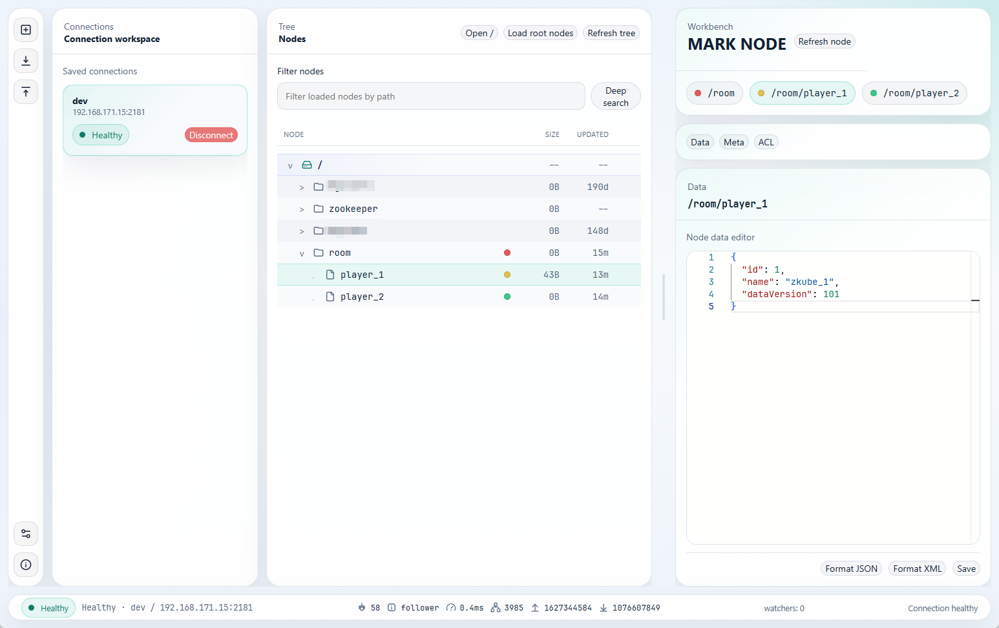
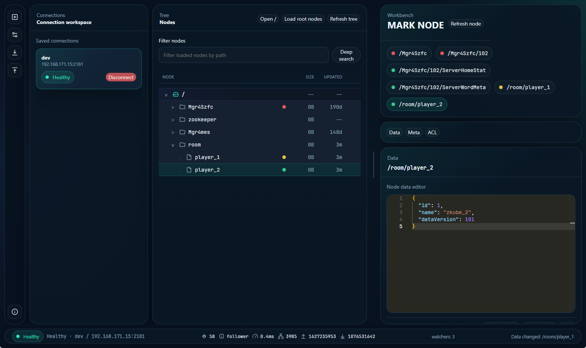

# ZKube

<p align="center">
  <strong>A modern desktop workbench for Apache ZooKeeper.</strong>
</p>

<p align="center">
  Built with Electron, React, TypeScript, and Monaco Editor.
</p>

<p align="center">
  <a href="./README.zh-CN.md">Chinese</a>
  |
  <a href="https://github.com/espen7/ZKube">GitHub</a>
  |
  <a href="./CHANGELOG.md">Changelog</a>
  |
  <a href="./LICENSE">MIT License</a>
</p>

## Screenshot

### Light Theme



### Dark Theme



## Overview

ZKube is a desktop GUI for `Apache ZooKeeper` focused on the workflows engineers perform every day:

- switching between multiple ZooKeeper clusters
- browsing large node trees without loading everything at once
- editing node data with a modern code editor
- reviewing metadata and ACLs in a single workspace
- marking important nodes locally for faster navigation


## Why ZKube

ZooKeeper is simple in concept, but operational workflows quickly become awkward in old-style desktop clients. ZKube is designed to make those workflows feel more like a modern engineering console:

- **Connection workspace** for saved environments and quick switching
- **Dense tree browser** with lazy loading, filtering, deep search, and local node marks
- **Workbench editor** for node payloads, formatting, metadata, and ACL flows
- **Desktop-native runtime** with Electron IPC boundaries, persistent settings, and Windows packaging

## Feature Highlights

### Connection Management

- Save and edit connection profiles locally
- Import connections from JSON files
- Export saved connections to `zkube-connections.json`
- Distinguish active, connecting, healthy, and disconnected states
- Detect unexpected disconnects and surface a desktop dialog

### Tree Browsing

- Load root nodes on demand
- Expand child nodes lazily
- Search loaded nodes locally
- Run deep search against the active cluster
- Refresh the tree manually instead of relying on background watches
- Right-click nodes to create child nodes, delete nodes, or apply local color marks

### Local Node Marks

- Mark nodes with red, orange, yellow, or green
- Persist marks per connection profile and node path
- Show marks directly in the tree and in the workbench shortcut area
- Use marks as quick jump targets for important nodes

### Node Workbench

- Open nodes directly from the tree or search results
- Edit node data in Monaco Editor
- Format JSON and XML before saving
- Save node data using ZooKeeper version-based atomic updates
- Show clear version-conflict messaging when a node changed elsewhere
- Refresh a node manually and protect unsaved drafts from silent overwrite

### Metadata and ACLs

- View node path, version, child count, data size, and mtime in the `Meta` tab
- Inspect and edit the `world:anyone` ACL entry
- Keep metadata and editor flows aligned inside one workbench

### Desktop Experience

- Light and dark themes
- UI language switch: English / Simplified Chinese
- Global font size preference
- About dialog with application metadata
- Windows packaging through `electron-builder`

## Current Scope

ZKube is usable today for core read/write ZooKeeper workflows, but the current release scope is intentionally focused.

### Implemented

- Electron desktop app, currently released with Windows-first priority
- Direct ZooKeeper connection profiles
- Tree browsing, filtering, search, manual refresh
- Node create / delete / edit flows
- Local node marks
- Metadata and ACL inspection
- Packaging, unit tests, type checks, and Electron smoke coverage

### Intentionally Not in Scope Yet

- SSH tunneling
- Rich diff / history restore flows
- Full ACL authoring beyond the current scoped editor
- Background watch-driven live sync for every expanded path
- Finalized multi-platform packaging and release polish for macOS and Linux

## Tech Stack

- Electron 42
- React 19
- TypeScript
- Vite
- Zustand
- Monaco Editor
- `node-zookeeper-client`
- Vitest
- Playwright

## Getting Started

### Prerequisites

- Node.js 20 or newer
- npm
- Windows is currently the most direct environment for packaging and runtime parity

### Install

```bash
npm install
```

### Run the Renderer Only

Useful for quick UI iteration:

```bash
npm run dev
```

### Run the Full Electron App

Recommended for real feature development:

```bash
npm run dev:electron
```

## Validation

### Type Check

```bash
npm run typecheck
```

### Unit Tests

```bash
npm run test:unit
```

### Electron Smoke Tests

```bash
npm run test:e2e -- tests/e2e/app-smoke.spec.ts
```

## Build and Package

Build the renderer, Electron bundles, and Windows installer:

```bash
npm run build
```

Useful intermediate commands:

```bash
npm run build:renderer
npm run build:electron
npm run package:win
```

Build outputs are generated under:

- `dist/`
- `dist-electron/`
- `../ZKube-release/`

## Working with Real ZooKeeper Clusters

ZKube can connect to real environments. Before using it against shared or production clusters:

- verify the target hosts carefully
- understand the impact of create, edit, and delete operations
- prefer validating risky actions in a lower environment first
- keep imported/exported connection data under appropriate operational controls
- use manual refresh before assuming a node still reflects the latest cluster state

## Repository Layout

- `electron/`: Electron main process, preload bridge, and window/bootstrap logic
- `src/domain/`: domain logic for sessions and application behavior
- `src/infrastructure/`: storage, secret handling, and ZooKeeper adapters
- `src/renderer/`: React UI, layout, tree, workbench, settings, and dialogs
- `src/shared/`: shared IPC contracts, models, and error types
- `tests/domain/`: domain and Electron bootstrap tests
- `tests/renderer/`: renderer interaction and UI tests
- `tests/e2e/`: Playwright smoke coverage
- `docs/`: screenshots and planning/design artifacts

## Documentation

- Chinese documentation: [README.zh-CN.md](./README.zh-CN.md)
- Changelog: [CHANGELOG.md](./CHANGELOG.md)

## Roadmap

Planned follow-up areas include:

- broader ACL support
- stronger connection validation and import safeguards
- richer node comparison and recovery workflows
- macOS and Linux releases after the Windows-first experience is further hardened

## Contributing

Contributions are welcome, especially around:

- ZooKeeper workflow correctness
- Windows packaging and release quality
- UX refinement for tree and workbench interactions
- test coverage and runtime hardening

If you contribute, prefer focused changes with clear verification.

## License

This repository is licensed under the MIT License. See [LICENSE](./LICENSE) for details.
